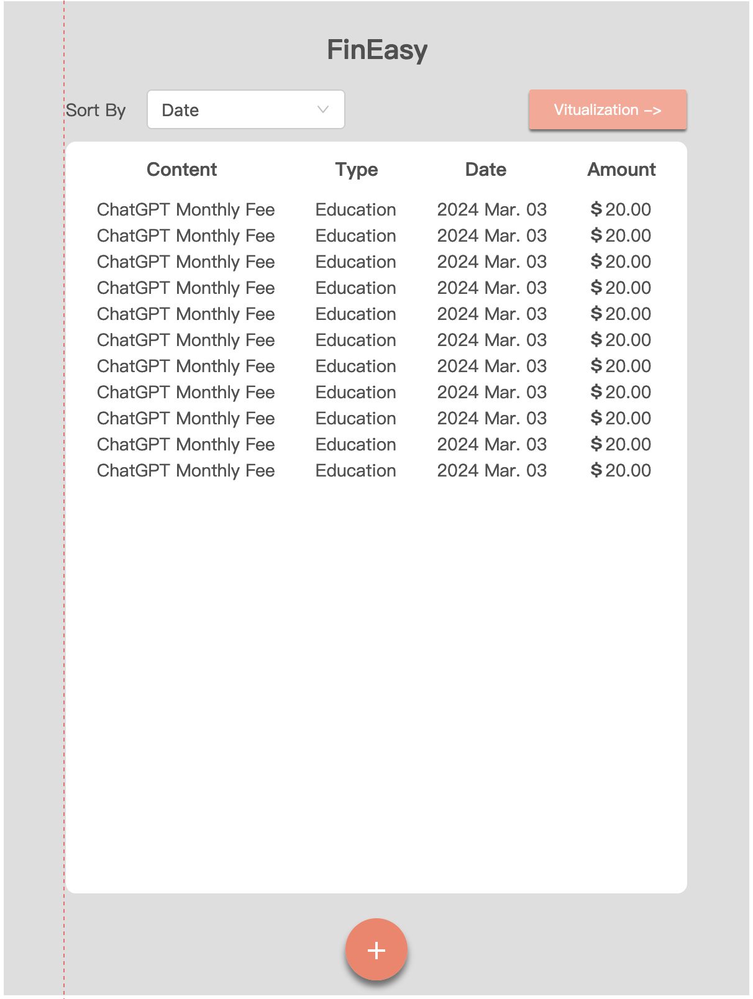
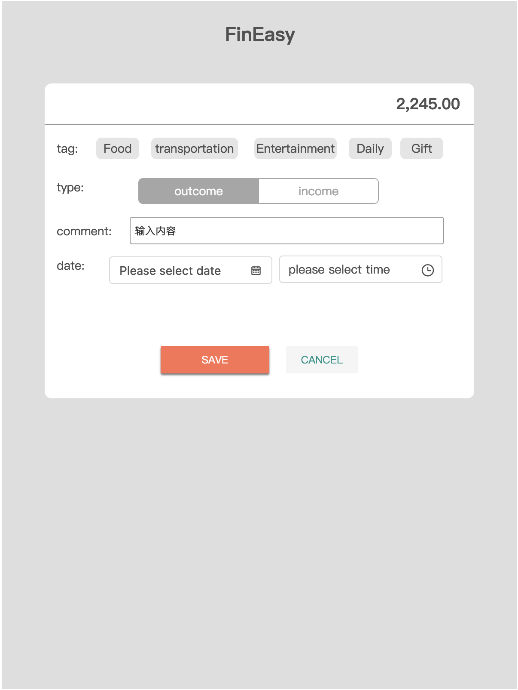
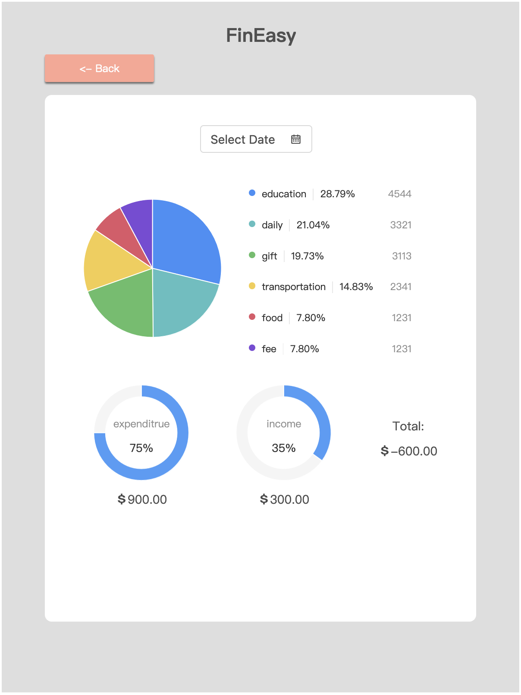
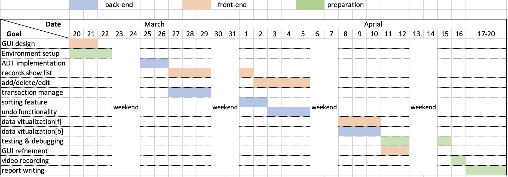

# INFO6205_FP

## Team Formation
**Team Name**: ByteBucks Brigade  
**Team Member**: Boyuan Ye, Jinmin Zhang, Qianru Cui

## Project Overview
#### Project Topic
- **Title**: FinEasy
- **Description**: FinEasy is a comprehensive application designed to simplify personal financial tracking and budgeting.
  It enables users to meticulously log their daily income and expenses, categorize each entry, and modify details or the sequence of records as needed.
  By default, records are organized chronologically, with options to sort by time or amount. A standout feature is the system’s ability to visually represent total expenditure through a dynamic pie chart, providing users with instant insights into their financial habits.

  
#### Project Statement
Recent years, everyone can make a payment easily via credit card or electronic payment, this brings a problem that we don't have a clear insight of our budget. 
It leads to that many individuals are not fully aware of their financial situation or where their money is being spent. Also, understanding overall spending habits and patterns can be difficult without visual aids.  
**Target Users**: Individuals who require a straightforward solution to monitor and analyze their personal financial data.

#### Objectives
The primary objective of FinEasy is to offer a user-friendly tool for individuals seeking a straightforward method to monitor and analyze their financial activities. It aims to empower users with the knowledge and insights needed to make informed financial decisions, encourage savings, and optimize spending patterns.

## Design
#### Tech Stack
- Java project in IntelliJ
- GUI using JavaFX
- Stacks for record undo functionality (user can add/delete/modify one record and undo this operation)
- Lists for transaction management(data storage and access)
- Sorting for transaction organization (sort the order in different way)
- Use Binary Search Tree to optimize the functionality of search record and sorting

#### Prototype

{:height="30%" width="30%"}  {:height="30%" width="30%"}  {:height="30%" width="30%"}

## Time Plan
